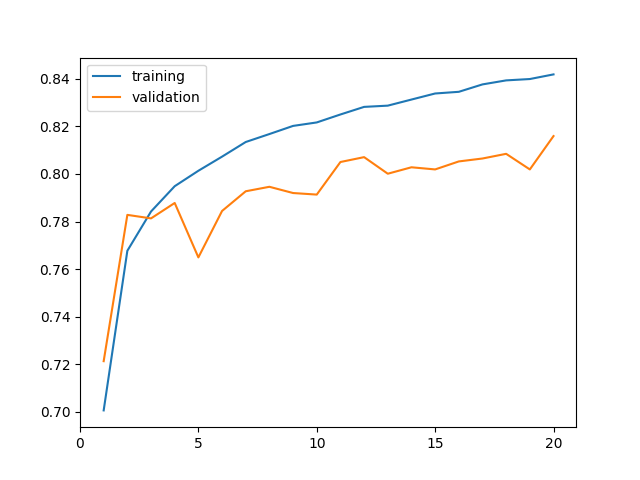
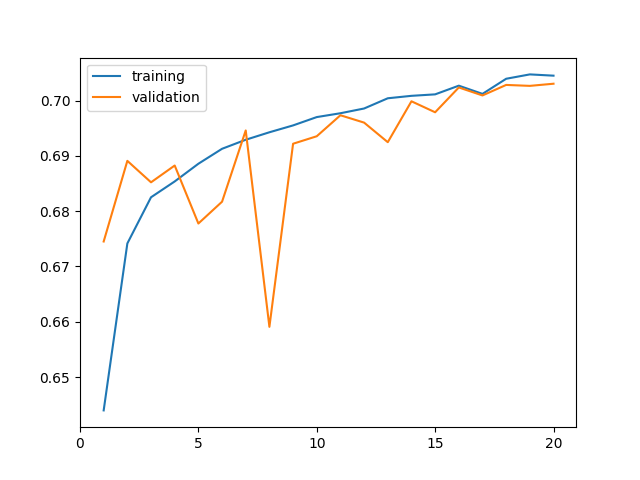

##  <div align="center">生成影像訓練資料集及整合檔案 ```build_dataset.py``` </div>
### <div align="center">生成的資料集搭配```train_img_ballpos.ipynb```及```train.ipynb```使用 </div>
### <div align="center">整合的檔案搭配```only_ball_dataset.py```及```pred_model.py```使用 </div>
<details>
<summary>參數及函式</summary>

```python
config = Namespace(
    path_setting = Namespace(
        data_path = '',         # 訓練資料路徑
        dataset_path = '',      # 生成訓練集路徑
        ball_data_folder = '',  # TrackNet資料路徑
    ),
    labels_setting = Namespace(
        pick_hit_frame = 1,         # 擊球幀範圍
        pick_non_hit_frame = [-1,1],# 擊球前後範圍   
        valid_random_factor = 2,    # Valid 非擊球動作的比例
    ),
    # img setting
    imgs_setting = Namespace(
        homography = True,          # 是否要做透視轉換
        new_image_size = (330,150), # 輸出影像大小 (透視轉換為True才會需要)
        img_size  = (1280 , 720),   # 輸入影像大小
        crop_top = (200 , 100),     # 裁切範圍 (透視轉換為True時不會裁切)
        crop_bottom = (200 , 0),    # 裁切範圍 (透視轉換為True時不會裁切)
        resize_factor = 4 ,         # 圖片縮小比例 (透視轉換為True時不會縮小)
    )
)
```

### ```get_labels_and_frame()``` 會產生資料集 同時可以透過多執行緒來加速
```python
# 多執行續產生資料集
CPU_Core_num = 6
pool = Pool(processes = CPU_Core_num) 
pool.starmap(get_labels_and_frame, zip(
        data_folder_list , 
        imgs_folder_list , 
        labels_folder_list , 
        repeat(Namespace(labels_setting = config.labels_setting , imgs_setting = config.imgs_setting))) , 
        chunksize = int(len(data_folder_list) / CPU_Core_num))
```
### ``` concat_ball_pos_files() ``` 會將TrackNet個別輸出的csv檔合成一個csv檔案
### ``` concat_hit_labels_files() ``` 會將原本訓練資料的csv檔合成一個csv檔案

</details>

##  <div align="center">生成羽球訓練資料集 ```only_ball_dataset.py```</div>
### <div align="center">生成的資料集搭配```train_only_ball_pos.ipynb```使用 <div>
<details>
<summary>參數</summary>


```python
# TrackNet資料路徑 (需經過build_dataset.py的concat_ball_pos_files()合成一份檔案)
all_ball_pos = pd.read_csv("") 
# 影片資料路徑 (需經過build_dataset.py的concat_hit_labels_files()合成一份檔案)
all_hit_labels = pd.read_csv("")
hit_range = 7   # 擊球幀的前後hit_range幀視為擊球動作 
f_range = 15    # 擊球幀要加入前後f_range幀羽球位置作為資料 
```

</details>

##  <div align="center">訓練影像模型(efficientnet_v2_s) ```kaggle/train.py``` </div>
### <div align="center">需使用```build_dataset.py```生成的資料集 </div>

<details>
<summary>參數</summary>

```python
# Data Augmentation
train_tfm = transforms.Compose([
    transforms.Resize(image_size),
    transforms.RandomAdjustSharpness(1.5, p=0.5),
    transforms.RandomHorizontalFlip(p=0.5),
    transforms.RandomRotation(10),
    transforms.RandomAutocontrast(p=0.5),
    transforms.ColorJitter(0.2,0.2,0.2,0.05),
    transforms.ToTensor(),
    transforms.RandomErasing(p=0.5,scale=(0.005,0.015),value=(1,1,1)),
])
# 訓練參數
batch_size = 32
n_epochs = 20
patience = 10   # 幾個epoch模型沒有進步就提早結束
criterion = nn.CrossEntropyLoss(label_smoothing = 0.05)
optimizer = torch.optim.Adam(model.parameters(), lr=0.0003, weight_decay=1e-5)
_exp_name = "hit_model" # best_model的名稱
nb_classes = 3          # 有幾個class
```
</details>

###  <div align="center">訓練結果acc = 0.74443</div>



##  <div align="center">訓練羽球模型(self-attention) ```kaggle/train_only_ball_pos.ipynb``` </div>
### <div align="center">需使用```only_ball_dataset.py```生成的資料集 </div>

<details>
<summary>參數</summary>

```python
# 模型參數
self.ball_prefc = nn.LazyLinear(256)
self.ball_attention = nn.TransformerEncoderLayer(256 , 1 , dim_feedforward = 256 , dropout=0.15 , batch_first = True)
self.ball_fc = nn.LazyLinear(nb_classes)

# 訓練參數
nb_classes = 2  # 有幾個class
batch_size = 32
n_epochs = 20   
patience = 10   # 幾個epoch模型沒有進步就提早結束
criterion = nn.CrossEntropyLoss(label_smoothing = 0.05)
optimizer = torch.optim.Adam(model.parameters(), lr=0.0003, weight_decay=1e-5)
_exp_name = "hit_model" # best_model的名稱
```
</details>

###  <div align="center">訓練結果acc = 0.70305</div>

 

##  <div align="center">訓練綜合模型(羽球+影像) ```kaggle/train_img_ballpos.ipynb``` </div>
### <div align="center">需使用```build_dataset.py```生成的資料集 </div>

<details>
<summary>參數</summary>

```python
# Data Augmentation
train_tfm = transforms.Compose([
    transforms.Resize(image_size),
    transforms.RandomAdjustSharpness(1.5, p=0.5),
    transforms.RandomHorizontalFlip(p=0.5),
    transforms.RandomRotation(10),
    transforms.RandomAutocontrast(p=0.5),
    transforms.ColorJitter(0.2,0.2,0.2,0.05),
    transforms.ToTensor(),
    transforms.RandomErasing(p=0.5,scale=(0.005,0.015),value=(1,1,1)),
])
# 模型參數
self.cnn_fc = nn.Linear(1000 , nb_classes)
self.ball_prefc = nn.LazyLinear(100)
self.ball_attention = nn.TransformerEncoderLayer(100 , 1 , dim_feedforward = 128 , dropout=0.15 , batch_first = True)
self.ball_fc = nn.LazyLinear(nb_classes)
self.fin_fc = nn.LazyLinear(nb_classes)

# 訓練參數
nb_classes = 2  # 有幾個class
batch_size = 32
n_epochs = 20   
patience = 10   # 幾個epoch模型沒有進步就提早結束
criterion = nn.CrossEntropyLoss(label_smoothing = 0.05)
optimizer = torch.optim.Adam(model.parameters(), lr=0.0003, weight_decay=1e-5)
_exp_name = "hit_model" # best_model的名稱
```
</details>

###  <div align="center">訓練結果acc = 0.81594</div>


##  <div align="center">使用模型進行預測 ```gen_model_pred.py``` </div>
### 產生JOSN檔案格式
```json
{
    "video_id": {
        "frame_index": label,
        "frame_index": label,
        "frame_index": label
    },
    "video_id": {
        "frame_index": label,
        "frame_index": label,
        "frame_index": label
    },
}
```
<details>
<summary>參數及函式</summary>

```python
# 只有羽球的模型(train_only_ball_pos.ipynb)引入的函式
from utils.get_model_pred import build_model , get_model_pred
# 羽球+影像的模型(train_img_ballpos.ipynb)引入的函式
from utils.get_model_pred_with_frame import build_model , get_model_pred

# TrackNet資料路徑 (需經過build_dataset.py的concat_ball_pos_files()合成一份檔案)
all_ball = pd.read_csv(f"") 

# 只有羽球的模型
model_pred = get_model_pred(model , all_ball[all_ball['VideoName'] == vid])
# 羽球+影像的模型需額外給予影片位置
model_pred = get_model_pred(model , all_ball[all_ball['VideoName'] == vid], 
                        f"./data/part1/train/{str(vid).rjust(5,'0')}/{str(vid).rjust(5,'0')}.mp4")
```

</details>

##  <div align="center">使用模型預測結果 + 擊球事件判斷進行結果預測 ```pred_model.py``` </div>

<details>
<summary>參數及函式</summary>

### ```get_confusion_matrix()``` 用於回測訓練資料
```python
# 影片資料路徑 (需經過build_dataset.py的concat_hit_labels_files()合成一份檔案)
all_hit_labels = pd.read_csv(f"") 
# 模型預測資料路徑 (需經過gen_model_pred.py生成)
with open(f"") as f:
    all_model_pred_with_img = json.load(f)

# TrackNet羽球的路徑
ball_csv = f"./data/ball_pred_V2{smooth}/{str(vid).rjust(5,'0')}_ball.csv"

smooth = ""     # 羽球位置是否經過smooth
state = "test"  # 現在要進行預測的資料
result.to_csv("" , index=False) # 預測結果的檔名
```
</details>

## csv 內有放入所有所需資料
## model_pred 內有我們模型所預測出來的所有資料